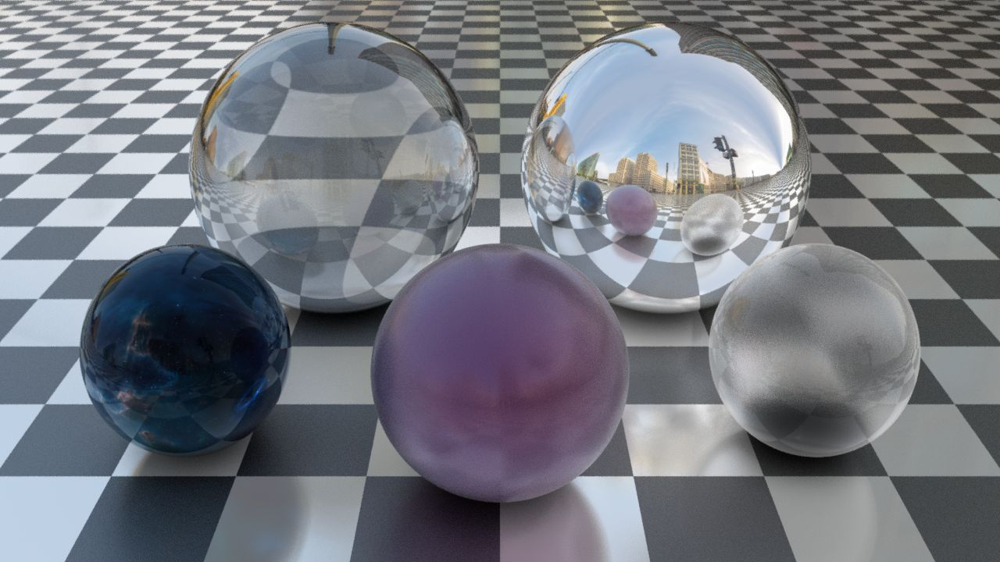

# rays

A raytracer written in rust with a focus on simplicity over features or performance. It's also probably not physically correct.

That said, it can make pretty neat pictures.

## Using rays

Coming soon (tm)... Basically change the scene setup in main.rs and then run it.

## Example

## Todo

- [ ] Transform into library instead of standalone project
- [ ] Get rid of all compiler warnings
- [ ] Move scene setup out of code into configuration file
- [ ] Write a better readme
- [ ] Support primitives beyond spheres and infinite planes
- [ ] Add more examples