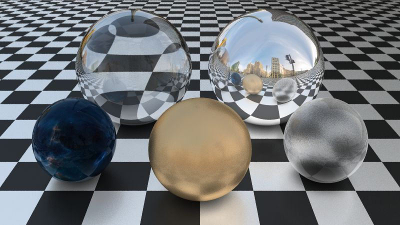

# rays

A raytracer written in rust with a focus on simplicity over features or performance. It's also probably not physically correct.

That said, it can make pretty neat pictures.

## Configuration Format

Each scene is described by a configuration file `scene-name.toml`, using the TOML format (https://github.com/toml-lang/toml). Configuration files are validated before rendering, so don't be afraid to experiment.

Some example configurations is are available in the project root.

### Materials

Usually, you want to start out by defining some materials. A material is specified in the following manner:

```toml
[[material]]
name = "pure-white"
color = [1.0, 1.0, 1.0]
opacity = { center = 1.0, edges = 1.0, power = 1.0 }
reflection = { center = 0.0, edges = 0.0, power = 1.0, max_angle = 0.0 }
refraction = { ior = 1.33, max_angle = 0.0 }
```

The only mandatory key is `name`. Omitted keys take their default values, which can be seen above. The default material is pure white without any reflections or transparency / refraction. Note that if you chose to specify the opacity, reflection and/or refraction keys, you need to specify them completely (all sub-keys). Partial definitions will be rejected.

### UV Mappers (optional)

UV mappers are important if you want a single piece of geometry to have multiple materials or a texture. If that is not the case, you won't need to bother with UV mappers.

For now, there are 2 types of UV mappers:

```toml
# Creates a checkerboard pattern of two materials
[[uvm-checkerboard]]
name = "chessboard"
even = "reflective-white" # 1st material
odd = "matte-black"       # 2nd material

# Takes a base material and the path to a 24bit PNG file
[[uvm-texture]]
name = "skysphere"
base = "reflective-white" # color of this material will be replaced with texture color
path = "D:/Downloads/skyline.png"
```

> Note: UV mappers **must not** share a name with any material

### Geometry / Objects

Geometry are the physical objects you want to display in your scene, usually including the skybox / skysphere. At the moment, only a few primitives are available:

```toml
[[obj-sphere]]
# You can use material names instead of UV mappers here:
uv-mapper = "pure-white"
origin = [0.0, 0.0, 0.0]
radius = 1.0
visible-to-camera = true # if false, can just be seen through reflection / refraction
rotation = [0.0, 0.0, 0.0] # only important if you care about uv orientation

[[obj-infinite-plane]]
uv-mapper = "chessboard"
origin = [0.0, 0.0, 0.0]
visible-to-camera = true
uv-scale = 0.1 # Distance after which uvs wrap around in world units
rotation = [0.0, 0.0, 0.0] # default orientation is flat on the XZ-plane

[[obj-plane]]
uv-mapper = "mirror"
origin = [0.0, 0.0, 0.0]
visible-to-camera = true
rotation = [0.0, 0.0, 0.0]
width = 1.0
height = 1.0

[[obj-cube]]
uv-mapper = "companion"
origin = [0.0, 0.0, 0.0]
visible-to-camera = true
rotation = [0.0, 0.0, 0.0]
width = 1.0
height = 1.0
depth = 1.0
```

None of the keys are required.

### Cameras (optional)

You can specify any number of cameras:

```toml
[[camera]]
name = "default"
position = [0.0, 0.0, -10.0]
rotation = [0.0, 0.0, 0.0]
viewport = { width = 16.0, height = 9.0 } # in world units
# Horizontal FoV (the vertical FoV is calculated at runtime)
fov_h = 60.0
```

Cameras don't have any required keys, except when there are more than one camera in a configuration; Then, the `name` field is required. All other fields will be set to the default value if omitted.

It is also possible to not specify a camera at all. In that case, a default camera is assumed.

### Render Parameters (optional)

You can specify any number of render parameter tables. Render parameters are a group of settings that determine the output image quality. Higher quality usually means longer rendering time.

```toml
[[render-params]]
name = "default-quality"
quality.min_intensity = 0.03
quality.max_bounces = 4294967295
quality.bias = 0.0001
dof.max_angle = 0.1
dof.samples = 10
max_samples.reflection = 6
max_samples.refraction = 1 # this gives a frosted glass effect
ao.strength = 0.8
ao.distance = 2.0
ao.samples = 3
```

Similarly to cameras, you only need to specify a `name` key if you have multiple `render-params` structs. Every key is optional and has a default value. It's also possible to omit this struct completely.

## Using rays

```sh
rays [-c "camera-name"] [-p "render-params-name"] [-q/Q quality] [-w 1280] [-h 720] scene.toml ["output.png"]
```

rays has pretty good command-line help (`rays --help`) that explains all possible parameters. Try it out!

## Examples




